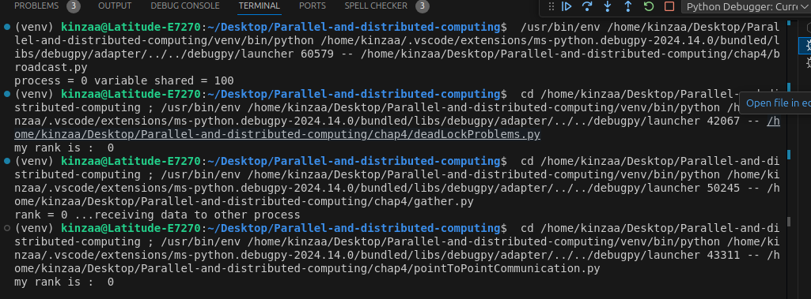

# Chapter 4: Message Passing with mpi4py

This chapter demonstrates the basic usage of the Message Passing Interface (MPI) in Python using the mpi4py library. The examples highlight several essential MPI communication methods that allow processes to interact and share data.
Key Concepts Covered

    Broadcasting: How to share a variable from the root process (rank 0) to all other processes in the system.

    Send/Receive Data: Demonstrates sending and receiving data between two processes, allowing for point-to-point communication.

    Gathering Data: Shows how processes can collect data from all participants and send it to a root process for further processing.

    Sending Data Between Different Processes: Explains how data can be sent between different processes with specific source and destination settings.

    Scattering Data: Distributes an array from the root process to all other processes, where each process receives a portion of the data.

Requirements

    Python 3.x
    mpi4py library (pip install mpi4py)
# Output

